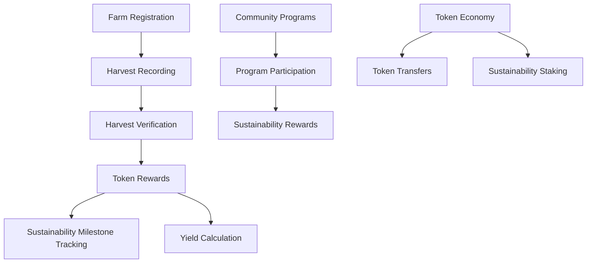

# Produce Engine 🌱

Produce Engine is a blockchain-powered agricultural ecosystem that tracks, verifies, and incentivizes sustainable farming practices through transparent and fair token rewards.

## Overview

Produce Engine creates a comprehensive agricultural tracking system by:
- Rewarding farmers with tokens for quality, verified harvests
- Incentivizing sustainable farming practices
- Offering milestone achievements with bonus rewards
- Enabling community sustainability programs
- Managing a token economy for agricultural innovation

## Architecture

The system is built around a core smart contract that handles:



Core components:
- Farm profiles with harvest history and sustainability metrics
- Harvest verification system with authorized agricultural inspectors
- Token reward calculation based on yield and sustainable practices
- Milestone achievement system
- Community sustainability programs

## Contract Documentation

### Harvest Tracker Contract

The main contract (`harvest-tracker`) manages all core functionality:

#### Key Features
- Farm registration and profile management
- Harvest recording and verification
- Token minting and distribution
- Sustainability tracking and bonus calculations
- Milestone achievement system
- Community sustainability program management

#### Access Control
- Contract owner: Can manage inspectors and end sustainability programs
- Authorized inspectors: Can verify harvests and create sustainability initiatives
- Farmers: Can record harvests, join programs, and transfer tokens

## Getting Started

### Prerequisites
- Clarinet
- Stacks wallet for deployment

### Basic Usage

1. Register a farm:
```clarity
(contract-call? .harvest-tracker register-farm)
```

2. Record a harvest:
```clarity
(contract-call? .harvest-tracker record-harvest u500 "organic")
```

3. Get farm profile:
```clarity
(contract-call? .harvest-tracker get-farm-profile tx-sender)
```

## Function Reference

### Farm Management
- `register-farm()`: Register a new farm
- `get-farm-profile(principal)`: Get farm's agricultural profile

### Harvest Management
- `record-harvest(uint, string-ascii)`: Record a new harvest
- `verify-harvest(principal, uint)`: Verify a completed harvest
- `get-harvest(principal, uint)`: Get harvest details

### Token Operations
- `get-token-balance(principal)`: Check token balance
- `transfer-tokens(principal, uint)`: Transfer tokens to another farm

### Sustainability Programs
- `create-program(string-ascii, string-utf8, uint, uint, uint)`: Create new sustainability program
- `join-program(uint)`: Join an existing program
- `record-program-harvest(uint, uint)`: Record harvest for sustainability program

## Development

### Testing
1. Clone the repository
2. Run Clarinet console:
```bash
clarinet console
```
3. Execute test commands:
```clarity
(contract-call? .harvest-tracker register-farm)
```

### Local Development
1. Install Clarinet
2. Initialize project:
```bash
clarinet new produce-engine
```
3. Copy contract code to `contracts/harvest-tracker.clar`

## Security Considerations

### Limitations
- Harvest verification relies on authorized agricultural inspectors
- Program rewards are distributed after program completion
- Token transfers are irreversible

### Best Practices
- Only use authorized inspectors for harvest validation
- Verify program parameters before joining
- Maintain sufficient token balance for program participation
- Be aware of program deadlines and sustainability requirements